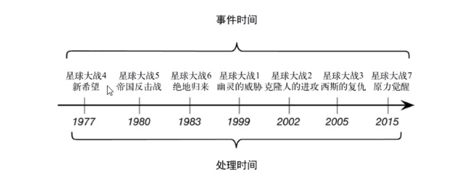

# FlinkTutorial
Flink from zero to one  
[TOC]

[WordCount](/src/main/jave/com/jw9j/wc/WordCount.java): 基于DataSet的wordcount
 [StreamWordCount](/src/main/jave/com/jw9j/wc/StreamWordCount.java) : 流数据读取处理
 

## 三. flink Source 支持与简单实现
1. [Collection](src/main/java/com/jw9j/source/SourceTest3_Collection.java) 集合
2. [文件读取](src/main/java/com/jw9j/source/SourceTest3_File.java)
3. [Kafka](src/main/java/com/jw9j/source/SourceTest3_Kafka.java)等消息队列
4. [UDF](src/main/java/com/jw9j/source/SourceTest4_UDF.java)( 函数类,匿名函数类,富函数)
   > 富函数
   > 富函数可以获取运行环境上下文,并拥有一些生命周期方法,所以可以实现更复杂的功能.
## 四. flink中的Transform

## 五. flink支持的数据类型
1. 基础数据类型
2. Java和Scala元组
3. Scala样例类
4. Java简单对象(POJOS)

## 六: Flink Sink
官方支持的数据连接器(flink 1.10):
kafka,ES,Hadoop,RabbitMQ,Apache Cassandra,

## 七：FLink windows
[时间窗口](src/main/java/com/jw9j/window/WindowsTest1_TimeWindows.java)
1. 滚动时间窗口
2. 滑动时间窗口
3. 会话窗口
[计数窗口](src/main/java/com/jw9j/window/WindowsTest2_CountWindow.java)

### 其他api
trigger() - 触发器： 定义windows 什么时候关闭，触发计算并输出结果; 
evictor() - 移除器： 定义一处某些数据的逻辑； 
allowedLateness() - 允许处理迟到数据 ; 
sideOutputLateDate() - 将迟到的数据放入侧输出流; 
getSideOutput() - 获取侧输出流; 

## 八：时间语义

电影拍摄时间：时间时间  
电影上映时间：处理时间
> setStreamTimeCha

### watermark
解决由于网络，分布式等原因导致乱序数据的问题

#### 特点：
1. 是一条特殊的数据记录
2. 必须单调递增，以确保任务的事件始终在向前推荐，而不是后退
3. watermark 与数据事件戳关联

